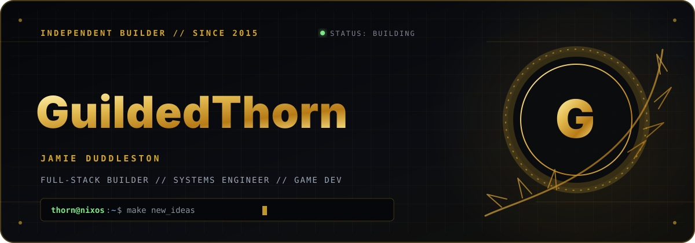

  

## I build past the part that fits in a job title.

I'm Jamie Duddleston—**Thorn** online. I'm a freelance developer, systems engineer, and data analyst. I've been programming since 2015, but the useful description is simpler: **I follow problems all the way down.**

Frontend, backend, infrastructure, security, data, and hardware aren't separate lanes to me. They're different surfaces of the same system. When an idea reaches a layer I don't know yet, I learn that layer and keep moving.

> Life is not what others force on us, but what we make it for ourselves.

## Systems in the wild

### 01 — [GuildedThorn.com](https://guildedthorn.com)

**A personal site that refused to stay a personal site.**

It's my digital headquarters: portfolio, publishing platform, photo archive, internet radio, live chat, guestbook, and a collection of tools—all operated as one self-hosted system. React and TypeScript shape the interface; ASP.NET Core runs the backend; SignalR carries the live features; MongoDB keeps state; Nix makes the whole thing reproducible.

[Read the source →](https://github.com/GuildedThorn/GuildedThorn.com)

### 02 — [ThornBot](https://github.com/GuildedThorn/ThornBot)

**Community infrastructure with a Discord interface.**

A C# bot built around Discord.Net and Victoria for music, automation, and the jobs nobody in a community should have to repeat by hand.

### 03 — [RemoteRPC](https://github.com/GuildedThorn/RemoteRPC)

**Presence across a boundary that should stay closed.**

A deliberately small Python bridge that carries Discord Rich Presence out of a FlareVM without putting a Discord token inside it. It started as a solution for an isolated reverse-engineering environment and became useful anywhere presence needs to cross a machine boundary.

## The working theory

> Knowledge is the best form of perception. You cannot understand what you have not done.

**Build for contact with reality.** An idea isn't understood until it has survived implementation, failure, and revision.

**Automate irritation.** Repetition is usually a system asking to be designed.

**Own the boundary.** The work doesn't end where a job title or framework says it should; it ends where the problem does.

**Keep the strange idea.** “Unusual” and “wrong” aren't synonyms.

## The rest of the map

The same curiosity keeps pulling me through **self-hosting**, **Android modding**, **Kali labs**, **internet radio**, **hardware experiments**, and **game development**. Those aren't side quests—they're where techniques collide and new projects begin.

Code is the medium. Understanding how things work is the actual obsession.

## Open channel

[Website](https://guildedthorn.com) / [LinkedIn](https://www.linkedin.com/in/jamieduddleston) / [X](https://x.com/GuildedThorn) / [YouTube](https://www.youtube.com/@GuildedThorn) / [Twitch](https://www.twitch.tv/xguildedthorn) / [XDA](https://forum.xda-developers.com/m/guildedthorn.12219983/) / [Kali Forums](https://forums.kali.org/u/guildedthorn/summary)

If something I built saved you time or taught you something, you can [buy me a coffee](https://www.buymeacoffee.com/GuildedThorn) or [send support through PayPal](https://www.paypal.com/paypalme/GuildedThorn).

---
